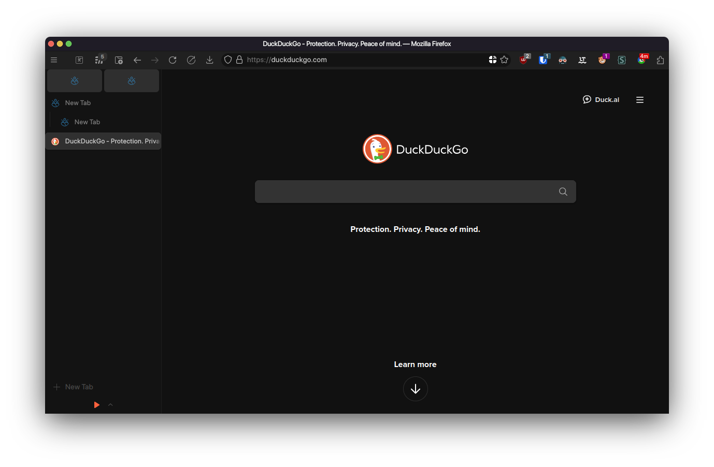

# firefox-minimal-compact-css

My personal Firefox theme.

## Features

- Compact, rounded UI with more Icons
- Shows amount of tabs on the Sidebery icon
- Doesn't show tabs when there is only one tab
- Use Sideberry Icon or set a hotkey via addon settings for `Open/Close sidebar panel` to switch between horizontal and vertical tabs
- Menu highlights matching to my KDE Plasma theme
- Bouncing indicator line while page is loading
- Resizable Sidebar with minimal splitter that only shows on hover
- Use `SF Pro Display` font if installed

## Installation

1. Open Firefox and go to `about:config`
2. Set `toolkit.legacyUserProfileCustomizations.stylesheets` to `true`
3. Set `browser.compactmode.show` to `true`
4. Install [Sidebery](https://addons.mozilla.org/firefox/addon/sidebery/)
5. If you have used Sideberry before, you should use the minimal config otherwise use the full config

   **Minimal Config:**
   - In Sideberry settings, enable `Add preface to the browser window's title if Sidebery sidebar is active`
   - Set the preface value to the invisible character between these markers: **`​`**
   - In the Styles editor, paste the contents of [sideberry.css](./sideberry.css)

   **Full Config:**
   - In Sideberry settings, click on Help
   - Select Import addon data
   - Import the file [sideberry-data.json](./sideberry-data.json)
7. Go to `about:support` and click on `Open Profile Folder`
8. Clone the repository in this folder by opening a terminal and running `git clone --recursive https://github.com/D3SOX/firefox-minimal-compact-css.git chrome`
9. Restart Firefox
10. Customize Toolbar: Set Density to Compact, put in the following items (Links are addons, you have to install and pin them first):
    - [Close Tab Button](https://addons.mozilla.org/firefox/addon/close-the-tab-button/)
    - [Sidebery](https://addons.mozilla.org/firefox/addon/sidebery/)
    - [Simple New Tab Button](https://addons.mozilla.org/firefox/addon/simple-new-tab-button/)
    - Back, Forward, Reload
    - [Reload Skip Cache Button](https://addons.mozilla.org/firefox/addon/reload-skip-cache-button/)
    - Downloads (right click and uncheck `Hide Button When Empty` if you want that)
    - URL Bar, Addon-specific Icons, Extensions icon
11. Enjoy!

## Optional: Smooth Scrolling

I also like to configure smooth scrolling similar to Zen.
To do that, go to `about:config` and set

- `general.smoothScroll.msdPhysics.continousMotionMaxDeltaMS` to `12`
- `general.smoothScroll.msdPhysics.enabled` to `true`
- `general.smoothScroll.msdPhysics.motionBeginSpringConstant` to `600`
- `general.smoothScroll.msdPhysics.regularSpringConstant` to `650`
- `general.smoothScroll.msdPhysics.slowdownMinDeltaMS` to `25`
- `general.smoothScroll.msdPhysics.slowdownSpringConstant` to `250`

## Credits

- Partially based on [ArcWTF](https://github.com/KiKaraage/ArcWTF)
- Uses CSS from [firefox-csshacks](https://github.com/MrOtherGuy/firefox-csshacks) and [CustomCSSForFx](https://github.com/Aris-t2/CustomCSSForFx)